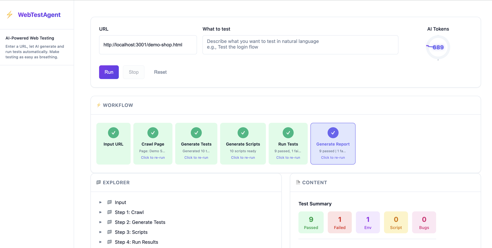
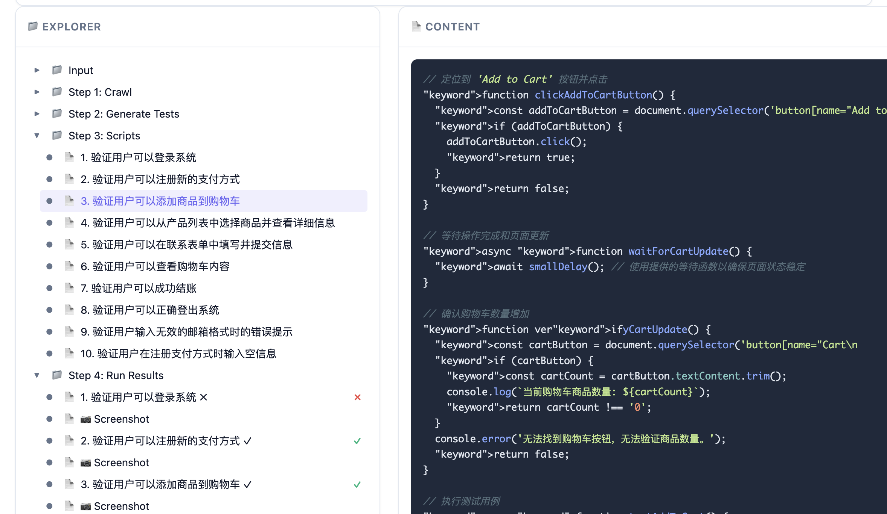
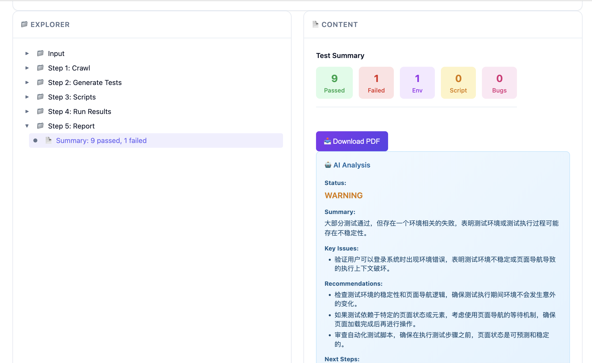

# WebTestAgent

**让测试变得像呼吸一样简单** 🌬️

一个 AI 驱动的 Web 自动化测试工具。只需输入网址，AI 自动帮你完成测试用例生成、执行和结果分析。

> 🚀 **理念**：小公司不需要专职测试人员，业务人员、产品经理、开发者都能一键生成测试。

## 目录

- [特性](#特性)
- [适用场景](#适用场景)
- [效果展示](#效果展示)
- [快速开始](#快速开始)
- [使用内置 Demo](#使用内置-demo)
- [工作流程](#工作流程)
- [项目结构](#项目结构)
- [配置说明](#配置说明)
- [命令](#命令)
- [开发指南](#开发指南)
- [CI/CD](#cicd)
- [常见问题](#常见问题)

## 特性

- **一键自动化**：输入 URL，AI 自动分析页面、生成测试用例，执行验证
- **无需编码**：不需要编写任何测试代码，会上网就会用
- **流式体验**：实时看到测试用例生成、执行的每个阶段
- **AI 分析**：自动分类错误类型（环境问题 / 脚本错误 / 真实 Bug）
- **PDF 报告**：一键生成完整测试报告，支持下载

### 技术亮点

- **智能缓存**：基于 URL + 页面内容 hash 双重验证，避免重复爬取
- **LLM 响应缓存**：相同页面 + 相同需求时复用 AI 回答，节省 API 费用
- **多模型支持**：支持 OpenAI、Anthropic、Minimax 等兼容 OpenAI API 的大模型
- **Accessibility Tree**：基于无障碍树定位元素，脚本更稳定

## 适用场景

- ✅ 回归测试：快速验证核心功能是否正常
- ✅ 冒烟测试：新版本发布前的快速检查
- ✅ 探索性测试：AI 自动发现潜在问题
- ✅ 零测试团队：中小公司无需专职测试人员

## 效果展示







## 快速开始

### 1. 克隆项目

```bash
git clone <repository-url>
cd PlaywrightAIAgent
```

### 2. 安装依赖

```bash
npm install && cd client && npm install
```

### 3. 配置 API Key

复制配置示例文件：

```bash
cp .env.example .env
```

编辑 `.env`，填入你的 API Key：

```bash
MINIMAX_API_KEY=your_api_key_here
```

> 支持 OpenAI、Anthropic、Minimax 等兼容 OpenAI API 格式的大模型

### 4. 启动服务

```bash
# 启动后端 + 前端
npm start
```

### 5. 开始测试

1. 打开浏览器访问 http://localhost:5173
2. 在 URL 输入框填入测试地址
3. 描述你想测试的内容（可选）
4. 点击「Run」
5. 实时查看测试进度，完成后查看结果或下载 PDF 报告

## 使用内置 Demo

系统已预置测试网站，直接可用：

| 网站 | URL |
|------|-----|
| 商店首页 | http://localhost:3001/demo-shop.html |
| 支付表单 | http://localhost:3001/payment-form.html |

## 工作流程

```
Input URL → Crawl Page → Generate Tests → Generate Scripts → Run Tests → Generate Report
```

1. **Input URL**：输入要测试的网页地址
2. **Crawl Page**：抓取页面 accessibility tree
3. **Generate Tests**：AI 分析页面，生成测试用例（流式显示）
4. **Generate Scripts**：转换为 Playwright 自动化脚本
5. **Run Tests**：执行测试，支持实时进度
6. **Generate Report**：AI 分析结果，生成 PDF 报告

## 项目结构

```
PlaywrightAIAgent/
├── client/          # 前端界面 (React + Vite)
├── server/          # 后端服务 (Express)
├── demo-shop/       # 内置测试网站
├── data/            # 测试数据存储
└── .env             # 配置文件（需自行创建）
```

## 配置说明

### AI 配置

| 变量 | 说明 | 默认值 |
|------|------|--------|
| `MINIMAX_API_KEY` | AI API Key | （必填） |
| `MINIMAX_BASE_URL` | API 地址 | https://api.minimax.chat/v1 |
| `MINIMAX_MODEL` | 使用模型 | abab6.5s-chat |

### Redis 缓存配置（可选）

| 变量 | 说明 | 默认值 |
|------|------|--------|
| `REDIS_HOST` | Redis 主机 | localhost |
| `REDIS_PORT` | Redis 端口 | 6379 |
| `REDIS_PASSWORD` | Redis 密码 | （无） |
| `REDIS_TTL_MS` | 缓存过期时间（毫秒） | 3600000（1小时） |

> 启用 Redis 后，页面爬取和 LLM 响应会被缓存，重复测试时速度更快、费用更低。

### 服务配置

| 变量 | 说明 | 默认值 |
|------|------|--------|
| `PORT` | 服务端口 | 3001 |

## 命令

| 命令 | 说明 |
|------|------|
| `npm start` | 启动完整服务（后端 + 前端） |
| `npm run dev` | 后端热重载开发模式 |
| `cd client && npm run dev` | 单独启动前端 |
| `npm test` | 运行单元测试 |

## 开发指南

### 运行测试

```bash
npm test
```

### 项目结构

```
WebTestAgent/
├── .github/workflows/   # CI 配置
├── client/             # 前端界面 (React + Vite)
├── server/             # 后端服务 (Express)
├── test/               # 单元测试
├── demo-shop/          # 内置测试网站
├── data/               # 测试数据存储
├── .env                # 配置文件（需自行创建）
└── LICENSE             # MIT 许可证
```

## CI/CD

项目已配置 GitHub Actions，每次提交自动运行测试。


## 常见问题

**Q: 需要编程基础吗？**
> 完全不需要。只需要会打开网页、输入网址即可。

**Q: 测试收费吗？**
> 工具本身免费。你需要自备 AI API Key（按调用量计费）。

**Q: 支持哪些网站？**
> 任何公开可访问的网站都可以测试。

---

Made with ❤️ for better testing
